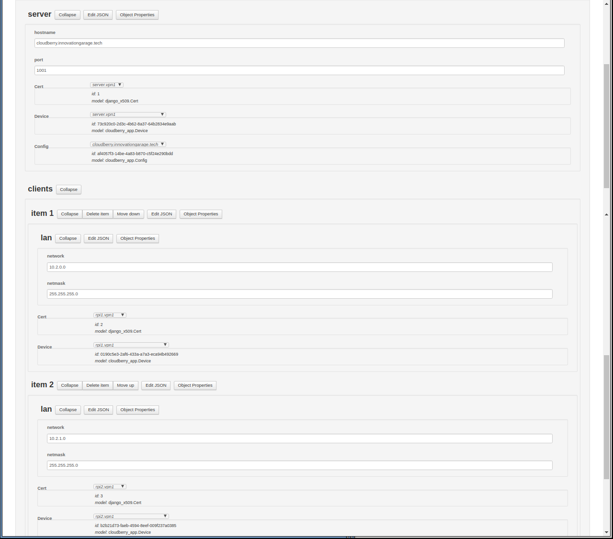

# The Cloudberry project
This project aims to simplify setting up OpenWRT, OpenWISP and OpenVPN for different use cases. In particular, it makes it
easy to set up groups of OpenWRT based VPN clients that each connect to a dockerized VPN server to route traffic between each other. To Achieve this, Cloudberry implements a few new features on top of OpenWISP and OpenWRT:

* Multiple devices can be configured together in a single configuration that refers to the devices for various roles (e.g. server, clients, different types of clients...)
* Configuration can be arbitrarily abstracted using transformations written in the [SakForm](https://github.com/innovationgarage/sakstig) JSON templating language
* Configuration can optionally refer to other resources using drop-downs (e.g. certificates, CA:s)
* Docker containers running OpenWRT, OpenWISP and OpenVPN can be deployed and configured from OpenWISP.

In addition it adds the following usability features

* Import / export of configurations, transforms and device data
* Versioning of configurations, transforms and device data
* Access control based on group ownership of configurations, transforms and device data.

For more information on how to set up the RPi devices and how the components work, please see the [project wiki](https://github.com/innovationgarage/cloudberry/wiki).

## Main components

* [djangoproject](https://github.com/innovationgarage/cloudberry-djangoproject) - Centralized configuration web UI 
* [docker-manager](https://github.com/innovationgarage/cloudberry-docker-manager) - OpenWISP front-end to docker
* [lede-openwisp-docker](https://github.com/innovationgarage/cloudberry-lede-openwisp-docker) - OpenWISP docker image

## Library projects (semi-unrelated)
* [netjson](https://github.com/innovationgarage/cloudberry-netjson) - netjson extension schemas
* [SakStig / SakForm](https://github.com/innovationgarage/sakstig) - JSON query and templating language

## Screenshots

